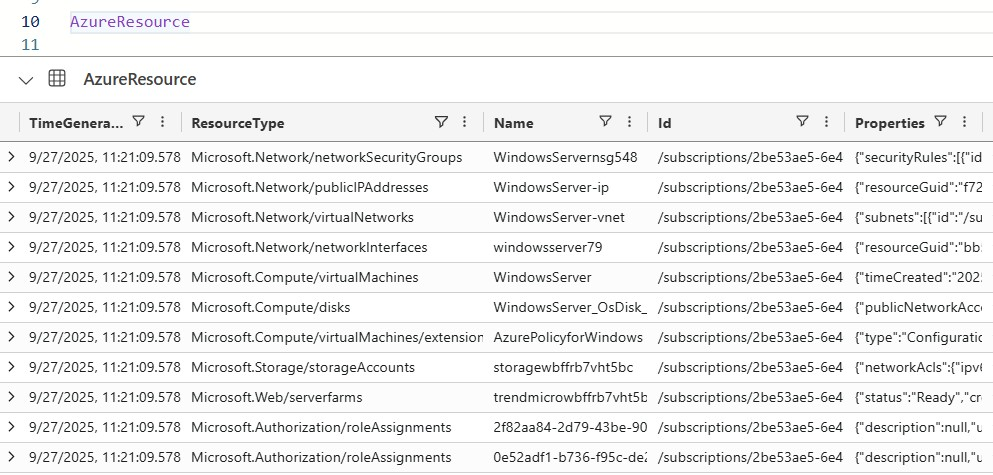

# Azure Subscription Export to ADX

[](https://azure.microsoft.com/en-us/services/functions/)
[](https://docs.microsoft.com/en-us/powershell/)
[](https://opensource.org/licenses/MIT)

> **Professional-grade Azure Function App that recursively exports Azure Subscription Objects and Role Assignment permissions to Azure Data Explorer (ADX) or Fabric via Event Hubs.**



## 🏗️ **Architecture Overview**

This solution provides automated, secure, and scalable extraction of Azure AD identity data using:

- **Azure Functions** (PowerShell) for serverless execution
- **Managed Identity** for secure, password-less authentication
- **Event Hub** for reliable data streaming to ADX
- **Application Insights** for monitoring and telemetry

## 🚀 **Quick Start**

### Prerequisites

- Azure subscription with contributor access
- PowerShell 7.0+ (for local development)
- Azure CLI or Azure PowerShell module

## 🔧 **Configuration**

### **Environment Variables**

| Variable            | Description                | Example                                |
| ------------------- | -------------------------- | -------------------------------------- |
| `EVENTHUBNAMESPACE` | Event Hub namespace        | `your-eh-namespace`                    |
| `EVENTHUB`          | Event Hub name             | `aad-export-hub`                       |
| `CLIENTID`          | Managed Identity client ID | `12345678-1234-1234-1234-123456789012` |

### **Required Permissions**

The managed identity requires these Azure application permissions:

- `Reader` - Read all subscription objects
- `Azure Access Administrator` - Read Role assignments from Azure

## 📁 **Project Structure**

```
src/FunctionApp/
├── host.json                          # Function app configuration
├── profile.ps1                        # Startup initialization  
├── requirements.psd1                  # PowerShell dependencies
├── TimerTriggerFunction/              # Scheduled execution
│   ├── function.json                  # Timer configuration (daily @ 1 AM)
│   └── run.ps1                        # Timer entry point
├── HttpTriggerFunction/               # Manual testing
│   ├── function.json                  # HTTP trigger configuration
│   └── run.ps1                        # HTTP entry point
└── modules/                           # Custom PowerShell modules
    ├── AZRest.psd1                   # Module manifest
    ├── AZRest.psm1                   # Module loader
    └── public/                        # Exported functions
        ├── Get-AzureADToken.ps1       # Managed identity authentication
        ├── Send-EventsToEventHub.ps1  # Event Hub integration
        └── [utility functions]
```

## **Scheduled Execution**

The timer trigger automatically executes daily at 1:00 AM UTC, ensuring fresh data availability for morning analytics and reporting. 

## 📄 **License**

This project is licensed under the MIT License - see the [LICENSE](LICENSE) file for details.

## 🏷️ **Version History**

| Version  | Date    | Changes                                         |
| -------- | ------- | ----------------------------------------------- |
| **v1.0** | Current | Initial release with basic export functionality |
|          |         |                                                 |
|          |         |                                                 |

## 📄 **Documentation**

- **📚 Detailed Documentation**: See [docs/](docs/) directory for comprehensive guides
- 
- **📖 API Reference**: See [docs/API-Reference.md](docs/API-Reference.md) for detailed function documentation